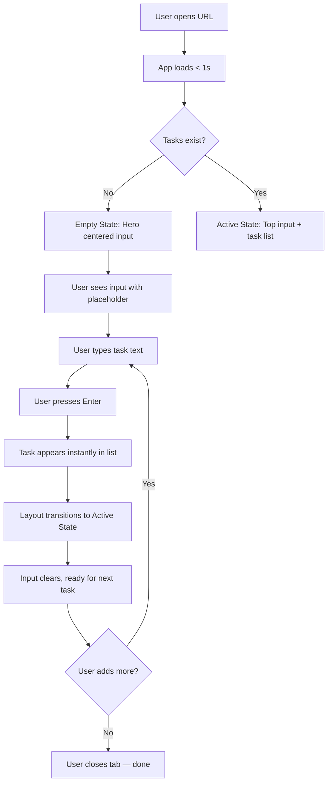
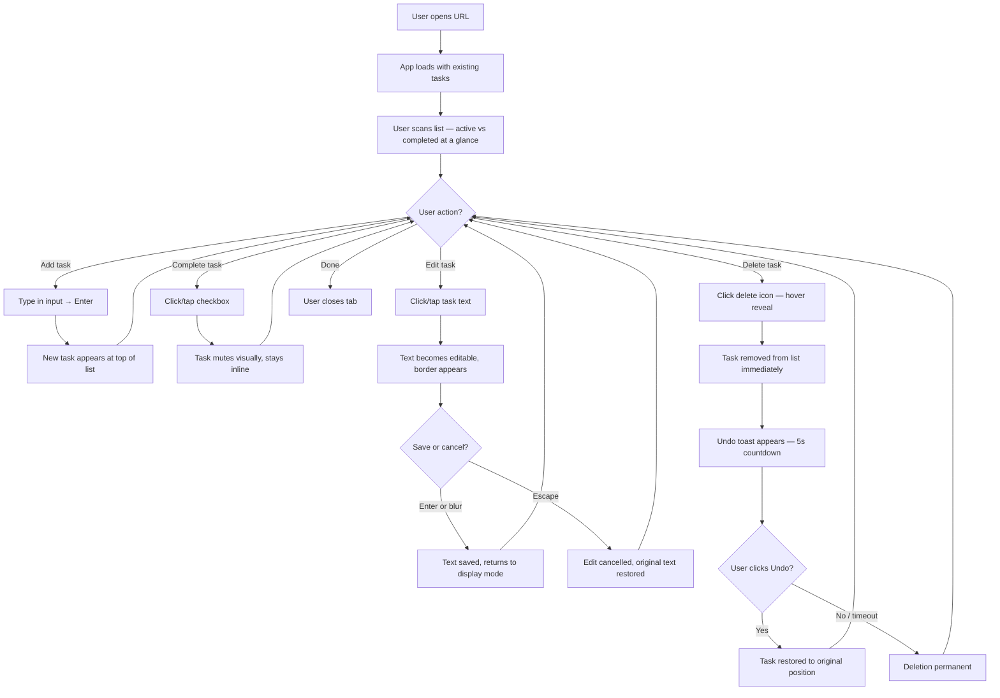
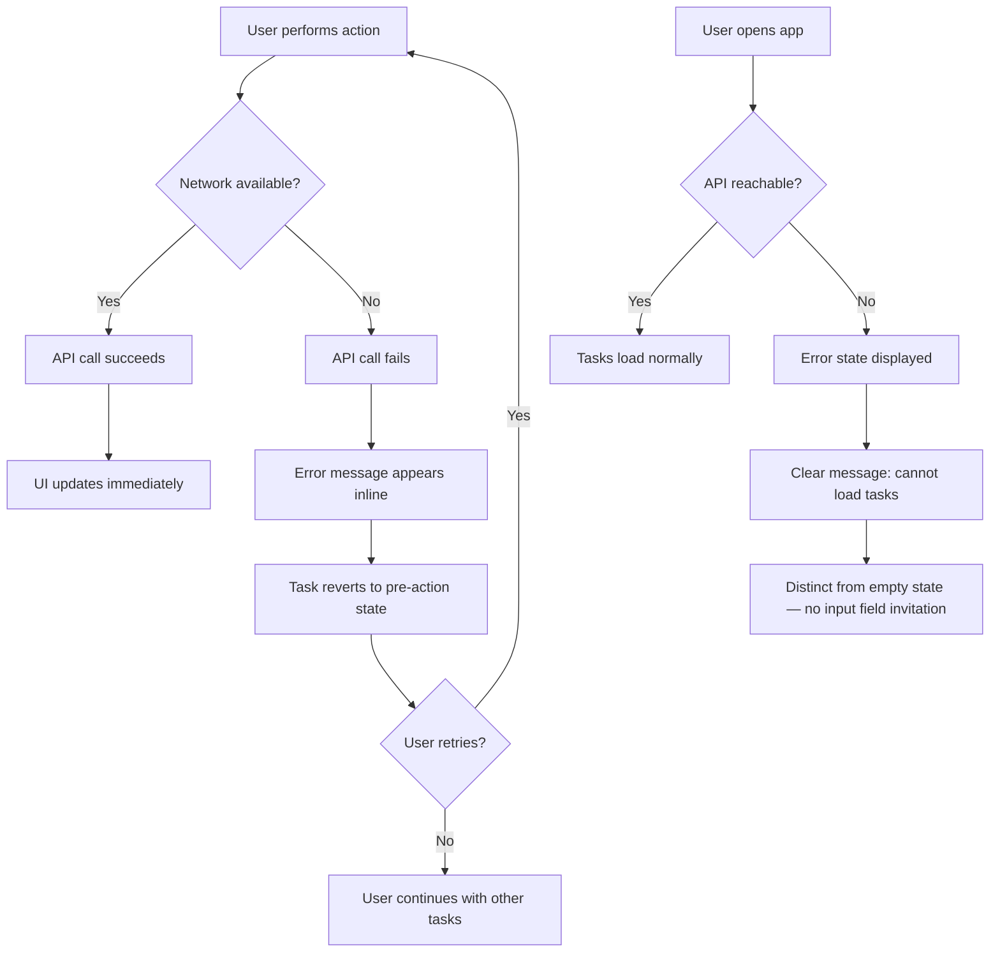

---
stepsCompleted:
  - 1
  - 2
  - 3
  - 4
  - 5
  - 6
  - 7
  - 8
  - 9
  - 10
  - 11
  - 12
  - 13
  - 14
inputDocuments:
  - prd.md
  - product-brief-todo.md
  - product-brief-todo-distillate.md
---

# UX Design Specification - Todo

**Author:** kris
**Date:** 2026-04-26

---

## Executive Summary

### Project Vision

Todo is a single-screen personal task manager built on the principle that the best tool is the one you don't have to think about using. The UX goal is radical simplicity: a user opens the app, sees their tasks, and performs any of five core actions (create, view, edit, complete, delete) without guidance, onboarding, or configuration. The interface must be self-evident to general consumers who have never used a dedicated task app.

### Target Users

Adults who currently track tasks with sticky notes, phone memos, text messages to themselves, or nothing at all. They span a broad range of tech-savviness but share one trait: they don't want to learn a system. The UX must work for someone who has never used a task app and someone who abandoned Todoist because it was too much. Desktop and mobile browser users equally — no platform preference assumed.

### Key Design Challenges

1. **Zero-onboarding legibility** — Every action must be discoverable without labels, tooltips, or tutorials. The input field must invite first-time interaction. Edit, complete, and delete affordances must be obvious without cluttering the single-screen interface.

2. **Inline editing without mode confusion** — Click-to-edit must not conflict with click-to-complete. The transition from display to edit mode needs clear visual signaling so users know they're editing, not selecting. This is the trickiest interaction design challenge in the product.

3. **Error states that preserve trust** — Network failures must surface visibly without being alarming or modal. The app must distinguish empty (no tasks) from broken (can't load) instantly. One silent data loss incident permanently breaks the user relationship.

### Design Opportunities

1. **Speed as a felt experience** — Sub-second load and sub-100ms interactions create a visceral speed advantage over every competitor. The UX should amplify this, not mask it with animations or transitions.

2. **Completed-task visual rhythm** — Inline-but-muted completed tasks create a satisfying sense of progress. Done items stay visible (users want to see what they accomplished) but don't compete with active tasks for attention.

3. **Empty state as first impression** — The empty list is most users' first experience. A single, inviting input field sets the tone for the entire product — this is the "aha" moment setup.

## Core User Experience

### Defining Experience

The atomic interaction that defines Todo is **adding a task**: type text, press enter, task appears. If this feels instant and frictionless, the product succeeds. The secondary loop is the daily scan: open → glance at list → check off done items → close. Both must feel effortless.

Todo eliminates friction that competitors impose: account creation, onboarding flows, project/category selection, and priority decisions. The user's mental model is a list — nothing more.

### Platform Strategy

- **Platform:** Web browser (desktop and mobile equally)
- **Input modes:** Mouse/keyboard on desktop, touch on mobile
- **Offline:** Not required for V1
- **Layout:** Single responsive screen adapts to all viewport sizes — same interaction model on every device
- **No native capabilities needed** — pure web, no camera, GPS, notifications, or device APIs

### Effortless Interactions

| Interaction | Target Experience |
|------------|-------------------|
| Add a task | Type + enter. No fields, no dialogs, no choices. |
| Scan the list | Completed vs active visible at a glance. No filtering needed. |
| Complete a task | Single tap/click. Immediate visual feedback. |
| Edit a task | Click text → editable → fix → enter/blur to save. |
| Delete a task | One action, immediate removal. No confirmation dialog. |
| Return after absence | Instant load, tasks exactly as left. No login, no session restore. |

### Critical Success Moments

1. **First 10 seconds** — User opens URL, sees input field, types a task, presses enter. Task appears instantly. "That's it?" This is the make-or-break moment. If it confuses or delays, the product fails.

2. **First return visit** — All tasks are exactly as left. Trust in persistence is established. If data is missing, trust is permanently and irreversibly broken.

3. **First inline edit** — User taps task text, it becomes editable, they fix the typo, press enter. If this accidentally triggers completion or deletion, the interaction model collapses.

### Experience Principles

1. **Immediacy** — Every interaction produces an instant result. No loading states between the user's intent and the outcome.

2. **Single-surface** — Everything happens on one screen. No navigation, no modals, no hidden panels. If you can see it, you can act on it.

3. **Invisible infrastructure** — Persistence, error handling, and responsiveness work silently. The user never thinks about "saving" or "syncing."

4. **Additive restraint** — If a UI element doesn't directly serve one of the five core actions, it doesn't exist.

## Desired Emotional Response

### Primary Emotional Goals

**North star emotion: Relief.** The dominant feeling is "I don't have to think about this." Not excitement, not delight — the absence of cognitive overhead. Users have been trained by other apps to expect friction, and the emotional reward is discovering there isn't any.

**Supporting emotions:**
- **Calm competence** — the app is invisible, the task gets done
- **Quiet satisfaction** — completing a task feels good without being performative
- **Informed confidence** — when something goes wrong, the user knows what happened

### Emotional Journey Mapping

| Stage | Target Feeling |
|-------|---------------|
| First discovery (open URL) | Curiosity → immediate clarity ("oh, it's just a list") |
| First task added | Surprise at simplicity → relief ("that's all?") |
| Core daily use | Calm competence — the app is invisible, the task gets done |
| Completing a task | Quiet satisfaction — muted visual acknowledgment, not celebration |
| Something goes wrong | Informed confidence — "I know what happened, I know it'll be okay" |
| Returning after absence | Trust confirmed — "everything is exactly where I left it" |

### Micro-Emotions

**Pursue:**
- **Confidence over confusion** — The user never hesitates about what to do. Every element has one obvious purpose.
- **Trust over skepticism** — Data reliability earns this over time. The first return visit is where trust is won or lost.
- **Calm over excitement** — The product respects the user's time by being quiet.

**Avoid:**
- **Anxiety** — "Did it save?" "Where did my task go?" "What does this button do?"
- **Overwhelm** — Too many visual elements, too many choices
- **Patronization** — Tutorials, tooltips, "Great job!" messages

### Design Implications

| Emotional Goal | UX Approach |
|---------------|-------------|
| Relief | Minimal UI, no chrome, breathing room in the layout |
| Calm competence | No animations that delay action, no celebratory feedback loops |
| Trust | Instant persistence confirmation (task appears immediately), clear error states |
| Confidence | Consistent interaction patterns across all five actions, no hidden states |
| Avoid anxiety | No ambiguous icons, no "did it work?" moments, visible feedback for every action |
| Avoid patronization | No tutorials, no achievement badges, no empty-state mascots |

### Emotional Design Principles

1. **Respect over engagement** — The app earns loyalty by respecting the user's time, not by demanding their attention.
2. **Silence is a feature** — The absence of noise (notifications, celebrations, prompts) is itself the emotional reward.
3. **Trust through consistency** — Every interaction works the same way every time. Predictability builds confidence.
4. **Error honesty** — When something fails, say so clearly and calmly. Never hide failures to protect the user's feelings.

## UX Pattern Analysis & Inspiration

### Inspiring Products Analysis

**Google Search Homepage**
- One input field, centered, nothing else competing for attention
- The interface *is* the action — there's no distinction between "the app" and "the thing you do"
- Zero cognitive load: you arrive knowing exactly what to do
- **Transferable insight:** The input field is the product. Everything else is secondary.

**Apple Notes**
- Opens to content instantly — no splash screen, no loading gate, no "select a notebook"
- The cursor is already in position to type on launch
- Minimal chrome — the toolbar exists but doesn't demand attention
- Persistence is invisible; you never "save"
- **Transferable insight:** The fastest path from intent to action is removing every step between opening the app and doing the thing.

**Clear (original iOS app)**
- Gesture-driven interactions felt physical and immediate — swipe to complete, pull to create
- No buttons for core actions — the content *was* the interface
- Visual hierarchy through color heat mapping (urgency = warmer colors)
- Satisfying feedback: items collapsing when completed felt like crossing something off paper
- **Transferable insight:** Direct manipulation of content is more intuitive than button-mediated actions. The task item itself should be the interactive surface.

### Transferable UX Patterns

**Input-first design (Google Search, Apple Notes)**
- The input field is the dominant element on first visit and empty state
- No intermediary screens between the user and their first action
- Todo application: The task input field should be the visual anchor of the entire interface — prominent, always visible, inviting

**Content-as-interface (Clear)**
- Task items are interactive surfaces, not just display elements
- Click/tap on the task text to edit. Checkbox area to complete. Swipe or button to delete.
- Todo application: Each task row is a self-contained interaction zone — the text is clickable to edit, the checkbox toggles completion, the delete action is accessible but not dominant

**Invisible persistence (Apple Notes)**
- No save button, no sync indicator, no "changes saved" toast
- Data is just *there* when you come back
- Todo application: Tasks appear in the list the moment enter is pressed. No confirmation. No "saving..." state. The list *is* the source of truth from the user's perspective.

**Breathing room (Google Search)**
- Generous whitespace signals simplicity and focus
- The absence of elements communicates "this is all you need"
- Todo application: Resist the urge to fill empty space. Whitespace around the task list is a feature, not wasted screen real estate.

### Anti-Patterns to Avoid

**"Set up your workspace" onboarding (Todoist, Notion)**
- Any step between opening the URL and adding a task is a failure. No welcome modal, no "choose your theme," no "create your first project."

**Blank page paralysis (Notion)**
- An empty state that offers too many options ("Start with a template? Import? Create a database?") paralyzes instead of inviting. Todo's empty state should have exactly one affordance: the input field.

**Feature menus as first impression (Todoist)**
- Sidebar navigation, project trees, label systems — all visible before the user has done anything. The interface complexity signals "this will take effort to learn."

**Confirmation dialogs for routine actions**
- "Are you sure you want to delete this task?" No. If the user said delete, they meant delete. Undo is better than confirmation for low-stakes actions, but even undo is a V1 nice-to-have, not a requirement.

### Design Inspiration Strategy

**Adopt:**
- Input-first layout from Google Search — the text field is the hero element
- Instant-to-content pattern from Apple Notes — no screens between open and action
- Invisible persistence — no save indicators, no sync status
- Generous whitespace as a simplicity signal

**Adapt:**
- Clear's content-as-interface — Todo uses click-to-edit rather than gestures (more accessible, works on desktop), but the principle of direct manipulation applies
- Clear's completion feedback — a subtle visual transition (muting) rather than Clear's dramatic collapse animation, aligned with our "calm, not exciting" emotional goal

**Avoid:**
- Any form of onboarding or setup flow
- Sidebar navigation or project hierarchy
- Feature-rich empty states with multiple options
- Confirmation dialogs for routine actions
- Save/sync indicators visible to the user

## Design System Foundation

### Design System Choice

**Tailwind CSS** — utility-first CSS framework providing full visual control without prescribing a design language.

### Rationale for Selection

- **Visual independence** — Todo looks like Todo, not like a framework. No inherited visual identity from Material Design, Ant Design, or similar opinionated systems.
- **Minimal footprint** — Tailwind purges unused utilities at build time. For an app with ~5 UI elements, the final CSS is tiny — aligned with NFR4 (minimal bundle size).
- **Rapid development** — Solo developer gets production-quality responsive and accessible utilities without writing custom CSS from scratch.
- **Full control** — Every pixel is intentional. The "breathing room" and "calm" emotional goals require precise spacing, color, and typography control that utility classes provide naturally.
- **Built-in responsive** — Mobile/desktop adaptation via utility breakpoints without a separate responsive strategy.
- **Accessibility utilities** — Focus ring styles, screen reader utilities, and color contrast tooling built in.

### Implementation Approach

- Use Tailwind's default configuration as a starting point, customized via `tailwind.config` for Todo's specific design tokens
- No additional component library — the app's component count is small enough to build each element directly with Tailwind utilities
- Leverage `@apply` sparingly for repeated patterns (e.g., task row styling) to keep markup readable
- Use Tailwind's dark mode utilities only if dark mode is added post-MVP — no configuration needed now

### Customization Strategy

- **Design tokens defined in Tailwind config:** colors, spacing scale, typography, border radius, transition timing
- **No pre-built theme** — design tokens will be established in the next steps (visual hierarchy, color, typography) and encoded directly in the Tailwind configuration
- **Component patterns** — since there's no component library, each UI element (input field, task row, checkbox, delete action, error message) will be a small, self-contained component styled with Tailwind utilities
- **Consistency enforcement** — Tailwind's constrained utility scale (spacing-4, spacing-6, etc.) naturally prevents arbitrary values and enforces visual consistency

## Interaction Design

### Defining Experience

**"Type a thought, press enter, it's saved."**

Like Tinder's "swipe to match" or Spotify's "play any song instantly," Todo's defining interaction is the irreducible act of capturing a thought. The gap between "I need to remember this" and "it's recorded" should be measured in keystrokes, not clicks.

### User Mental Model

Users bring the mental model of **a paper list**:
- You write something down → it's on the list
- You cross it out → it's done but still visible
- You erase it → it's gone
- You scratch out a word and rewrite → it's corrected

This is the oldest, most universal interface pattern in human history. Todo doesn't need to teach a new model — it needs to honor the existing one digitally. Every interaction should feel like the paper equivalent, just faster and persistent.

**What the paper model means for design:**
- No "submit" concept — writing *is* submitting (enter key = putting the pen down)
- No "save" concept — everything is always saved (like ink on paper)
- Crossing out doesn't remove — it marks as done (like a strikethrough on paper)
- Deleting is a separate, intentional act (like erasing or tearing off)

### Success Criteria

- Users say "this just works" — no moment of hesitation about what to do
- The first task is created in < 10 seconds from opening the URL
- Task creation feels instant — the new task appears in the list the moment enter is pressed
- Editing feels like correcting, not like a mode switch
- Completing a task feels like crossing it off — satisfying but not celebratory

### Pattern Analysis

**Entirely established patterns — zero novel interaction design needed:**
- Text input + enter to submit → universal web pattern
- Checkbox to toggle completion → universal UI pattern
- Click text to edit inline → established pattern (spreadsheets, Trello, etc.)
- Button/icon to delete → standard destructive action pattern
- Auto-dismissing undo toast → established recovery pattern (Gmail, Google Drive)

**Todo's twist:** Not innovation in any single pattern, but innovation in *what's absent*. The radical restraint of combining only these universal patterns with nothing else is itself the differentiator.

### Experience Mechanics

**1. Task Creation (the hero interaction)**
- **Initiation:** Input field is always visible at the top of the screen. Placeholder text invites action. On empty state, it's the only element.
- **Interaction:** User types text, presses enter.
- **Feedback:** Task appears instantly at the top of the list. Input field clears, ready for the next task. No animation delay.
- **Completion:** The task is in the list. Done. No confirmation needed.

**2. Task Completion**
- **Initiation:** Checkbox visible on every task row.
- **Interaction:** Single click/tap on checkbox.
- **Feedback:** Task visually mutes (reduced opacity, text styling change). Checkbox fills or checks. Stays inline.
- **Completion:** Visual state change is the confirmation. No toast, no sound, no animation.

**3. Task Editing**
- **Initiation:** Click/tap on the task text (not the checkbox, not the delete button).
- **Interaction:** Text becomes editable in place. Cursor appears. User types changes.
- **Feedback:** Visual border or highlight signals edit mode. The task row looks slightly different from display mode.
- **Completion:** Press enter or click/tap away (blur) to save. Press Escape to cancel. Task returns to display mode.

**4. Task Deletion**
- **Initiation:** Delete icon/button visible on hover (desktop) or always visible (mobile).
- **Interaction:** Single click/tap on delete.
- **Feedback:** Task disappears from the list immediately. A brief undo toast appears at the bottom of the screen ("Task deleted — Undo") and auto-dismisses after 5 seconds.
- **Recovery:** Clicking "Undo" restores the task to its original position and state. If the toast dismisses without action, the deletion is permanent.
- **Rationale:** Deletion is the only destructive action with no recovery path. The undo toast is the cheapest trust insurance — no modal, no interruption to flow, but prevents the one interaction that could permanently break the user relationship.

## Visual Design Foundation

### Color System

**Palette direction: Warm neutrals — approachable, not clinical.**

**Base colors:**
- **Background:** Warm white (#FAFAF8 or similar) — not pure white (#FFF), which feels sterile. A slight warm tint creates comfort.
- **Surface:** Slightly warmer (#F5F5F0) for input fields and task rows — subtle differentiation without hard borders
- **Text primary:** Warm dark (#2C2C2A) — not pure black (#000), which is harsh. Warm dark is easier on the eyes.
- **Text secondary:** Muted warm gray (#8A8A85) — for completed tasks and metadata
- **Text placeholder:** Light warm gray (#B5B5B0) — for input placeholder text, inviting but clearly not content

**Semantic colors (minimal — only what the app needs):**
- **Interactive/Focus:** A single accent color for focus rings, the checkbox fill, and the undo toast link. Suggest a calm blue (#4A90A4) or warm teal — not aggressive, not exciting, just clearly "this is interactive."
- **Error:** Warm red (#C5543A) — visible but not alarming. Used only for error states and the delete icon.
- **Success:** No dedicated success color needed. Task completion is communicated through muting, not through a green checkmark or success state.

**What's deliberately absent:**
- No gradient system
- No secondary/tertiary accent colors
- No color-coded categories (no categories exist)
- No dark mode in V1 (Tailwind supports it later if needed)

**Accessibility:** All text/background combinations must meet WCAG 2.1 AA contrast ratios (4.5:1 for normal text, 3:1 for large text). Warm neutral palette naturally supports this — warm dark on warm white exceeds 4.5:1.

### Typography System

**Typeface: Inter** — a polished, purpose-built screen typeface with excellent readability at all sizes. Open source, widely available via Google Fonts or self-hosted. Signals care and intentionality in a portfolio context without being distracting.

**Type scale (based on 8px grid):**

| Role | Size | Weight | Line Height | Usage |
|------|------|--------|-------------|-------|
| App title | 20px | 600 (Semi-bold) | 28px | "Todo" — appears once, top of screen |
| Task text | 16px | 400 (Regular) | 24px | Active task items — primary reading size |
| Task text (completed) | 16px | 400 (Regular) | 24px | Same size, reduced opacity + strikethrough or style change |
| Input placeholder | 16px | 400 (Regular) | 24px | Matches task text size for visual consistency |
| Error message | 14px | 500 (Medium) | 20px | Error state text — slightly smaller, medium weight for emphasis |
| Undo toast | 14px | 400/500 | 20px | Toast body + "Undo" link |

**Typography principles:**
- One typeface only (Inter) — no font pairing needed for an app this simple
- Two weights maximum in regular use (400 Regular, 600 Semi-bold)
- Task text and input text are the same size — reinforces the "what you type is what you see" mental model
- No ALL CAPS, no decorative type treatments

### Spacing & Layout Foundation

**Grid: 8px base unit.** All spacing values are multiples of 8px.

**Spacing scale:**

| Token | Value | Usage |
|-------|-------|-------|
| xs | 4px | Tight internal padding (icon-to-text within a button) |
| sm | 8px | Minimum spacing between related elements |
| md | 16px | Standard padding within components (task row internal padding) |
| lg | 24px | Space between task rows |
| xl | 32px | Section spacing (input area to task list) |
| 2xl | 48px | Major section margins, top/bottom page padding |

**Layout structure:**
- **Max content width:** 640px centered — task text doesn't need a wide reading column. Constraining width increases readability and reinforces focus.
- **Horizontal padding:** 16px on mobile, 24px+ on desktop (auto-centered within max-width)
- **Task row height:** Comfortable touch target — minimum 48px (44px content + 4px spacing), generous enough for thumb interaction
- **Input field:** Full width within content area, generous vertical padding (12-16px) to feel inviting, not cramped

**Layout principles:**
- Generous whitespace between task rows — each task is its own breathing unit
- No borders between tasks — spacing alone creates separation (cleaner, calmer)
- Vertical rhythm follows the 8px grid strictly — everything aligns
- Content is centered with constrained width — the empty space on sides reinforces "this is all there is"

### Accessibility Considerations

- **Color contrast:** All text meets WCAG 2.1 AA (4.5:1 minimum). Completed task muting must maintain 3:1 contrast for large text.
- **Focus indicators:** Visible focus ring (accent color) on all interactive elements — input field, checkbox, delete button, undo link. Never remove outline without replacing it.
- **Touch targets:** Minimum 44x44px for all interactive elements per WCAG. Task rows exceed this naturally with generous padding.
- **Motion:** No essential animations. Any transitions (e.g., task appearing in list, undo toast) are subtle and respect `prefers-reduced-motion` media query.
- **Font sizing:** Base 16px ensures readability without zooming. Users can scale with browser zoom and layout should accommodate.

## Design Direction Decision

### Design Directions Explored

Three layout variations were evaluated for Todo's single-screen interface:

- **Direction A (Top Input, Clean Rows):** Fixed top input, delete always visible. Simple and predictable but visually busier.
- **Direction B (Top Input, Hover Delete):** Fixed top input, delete revealed on hover. Cleaner default view, slightly less discoverable delete.
- **Direction C (Centered Hero Input):** Google Search-inspired centered input on empty state. Dramatic first impression, but layout shifts when tasks appear.

### Chosen Direction

**Direction B + C hybrid: Hero empty state with hover-reveal delete.**

**Empty state (first visit / no tasks):**
```
┌─────────────────────────────────┐
│                                 │
│                                 │
│              Todo               │
│                                 │
│  ┌───────────────────────────┐  │
│  │   What needs to be done?  │  │
│  └───────────────────────────┘  │
│                                 │
│                                 │
│                                 │
└─────────────────────────────────┘
```

**Active state (tasks exist):**
```
┌─────────────────────────────────┐
│           Todo                  │
│                                 │
│  ┌───────────────────────────┐  │
│  │ What needs to be done?    │  │
│  └───────────────────────────┘  │
│                                 │
│  ☑  Buy groceries               │
│  ☐  Call dentist            ✕   │  ← hover
│  ☐  Reply to landlord           │
│                                 │
└─────────────────────────────────┘
```

**Undo toast (after deletion):**
```
┌─────────────────────────────────┐
│           Todo                  │
│  ┌───────────────────────────┐  │
│  │ What needs to be done?    │  │
│  └───────────────────────────┘  │
│                                 │
│  ☐  Call dentist                │
│  ☐  Reply to landlord           │
│                                 │
│  ┌───────────────────────────┐  │
│  │ Task deleted · Undo       │  │
│  └───────────────────────────┘  │
└─────────────────────────────────┘
```

### Design Rationale

- **Hero empty state** — The centered input floating in whitespace creates the "aha" moment. It signals "this is all there is" more powerfully than a top-anchored input in an empty page. Directly inspired by Google Search's radical simplicity.
- **Transition to practical layout** — Once the first task is added, the input anchors to the top and stays there. The layout serves daily use (scan, add, check off) without the centered input getting in the way of a growing list.
- **Hover-reveal delete** — Cleaner default view aligns with the "calm" emotional goal. Fewer visible elements = less cognitive load. Delete appears on hover (desktop) or is always visible (mobile, where there is no hover).
- **Layout transition** — The shift from centered to top-anchored should be a smooth, subtle animation (CSS transition on position) — not jarring. Respects `prefers-reduced-motion`.

### Implementation Approach

**Two layout states, one screen:**
1. **Empty state:** Flexbox vertical centering. Title + input centered in viewport. No task list rendered.
2. **Active state:** Standard top-aligned flow layout. Title top-left or centered-top, input below, task list below that.
3. **Transition trigger:** Presence of at least one task in the list. When the last task is deleted (after undo expires), return to empty state.

**Hover-reveal delete:**
- Desktop: Delete icon (✕) appears on task row `:hover` with a subtle fade-in. Hidden by default.
- Mobile: Delete icon always visible (no hover state exists on touch devices). Detect via media query or pointer capability.
- Keyboard: Delete icon becomes visible on task row `:focus-within` for accessibility.

**Undo toast:**
- Fixed position at bottom of content area. Appears immediately on delete. Auto-dismisses after 5 seconds. Subtle slide-up entrance, fade-out exit. Contains task text summary + "Undo" link.

## User Journey Flows

### Journey 1: First Visit — "That's it?"

**Flow: From URL to first task created**



**Key interaction notes:**
- Empty → Active state transition is the critical moment. Must feel smooth, not jarring.
- Input field has autofocus on page load — cursor is ready, no click needed.
- Placeholder text ("What needs to be done?") is the only instruction the user ever receives.
- Task appears at top of list the instant Enter is pressed — no delay, no animation that blocks the next input.

### Journey 2: Daily Use — The 30-Second Session

**Flow: Open, scan, act, close**



**Key interaction notes:**
- All five actions available from the same screen — no mode switching, no navigation.
- Edit mode is visually distinct from display mode (border/highlight) to prevent confusion with completion toggle.
- Checkbox and task text are separate click targets with clear spatial separation — checkbox area (left) triggers completion, text area (center) triggers editing.
- Delete icon appears on hover (desktop) / always visible (mobile) — rightmost position, spatially separated from text and checkbox.

### Journey 3: Error Recovery — When Things Go Wrong

**Flow: Network failure during task operation**



**Key interaction notes:**
- Error state and empty state are visually distinct — empty state invites action (centered input), error state communicates a problem (error message, retry option).
- Failed operations revert the UI to pre-action state — no partial updates, no stale data.
- Error messages are inline, not modal — they don't block the user from interacting with tasks that are already loaded.
- On page load failure: the entire screen shows the error state. No input field (can't add tasks to a server you can't reach).

### Journey Patterns

**Consistent across all flows:**

| Pattern | Implementation |
|---------|---------------|
| Immediate feedback | Every action produces a visible result within 100ms — no "processing" states for user-initiated actions |
| Optimistic updates | UI updates before server confirms (for create, complete, edit). Reverts on failure. |
| Spatial consistency | Checkbox always left, text always center, delete always right. Never changes. |
| Single-action triggers | Every action is one click/tap. No long-press, no drag, no multi-step confirmation. |
| Error recovery | Failed actions revert cleanly. User can retry immediately. No "stuck" states. |

### Flow Optimization Principles

1. **Zero dead ends** — Every state has a clear next action available. Error states offer retry. Empty state offers the input field. Active state offers all five actions.
2. **No mode locks** — Edit mode doesn't prevent completion or deletion of other tasks. The undo toast doesn't block any interaction. Nothing takes over the screen.
3. **Predictable reversion** — If anything fails, the UI returns to exactly the state it was in before the action. The user never has to figure out "what happened."

## Component Strategy

### Design System Components

**Tailwind CSS provides utilities, not components.** There are no pre-built components to audit. Every UI element is custom-built with Tailwind utility classes. For an app with this few elements, this is ideal — no unused component library weight, full control over every detail.

### Custom Components

**Total component count: 6.** That's the entire UI.

**1. TaskInput**
- **Purpose:** Capture new task text. The hero element of the entire app.
- **Anatomy:** Single text input field, full-width, with placeholder text.
- **States:** Default (placeholder visible, subtle surface background), Focused (accent border/ring, cursor active), Typing (user text replaces placeholder), Empty submit (nothing happens — no error, no shake).
- **Accessibility:** `<input>` with `aria-label="Add a new task"`. Autofocus on page load. Enter key submits.
- **Interaction:** Type → Enter → input clears → task appears in list. No submit button.

**2. TaskItem**
- **Purpose:** Display a single task with all action affordances. The most complex component.
- **Anatomy:** `[Checkbox] [Task Text] [Delete Icon]` — three zones, left to right.
- **States:** Active (full opacity, unchecked), Completed (reduced opacity ~50-60%, styling change, checked), Hover/desktop (delete icon fades in, subtle row highlight), Edit mode (text becomes input with border/highlight), Deleting (row removed immediately, undo toast appears).
- **Variants:** None — every task looks the same.
- **Accessibility:** List item (`<li>`) within `<ul>`. Checkbox is `<input type="checkbox">` with `aria-label`. Task text clickable to edit. Delete button has `aria-label="Delete task"`. Focus-within reveals delete icon.
- **Interaction:** Checkbox toggles completion. Text click enters edit mode. Delete icon removes task.

**3. TaskList**
- **Purpose:** Container for all TaskItems. Ordered list, newest first.
- **Anatomy:** Vertical stack of TaskItem components with 24px gap.
- **States:** Populated (shows all tasks), Empty (not rendered — parent switches to EmptyState).
- **Accessibility:** Semantic `<ul>` with `aria-label="Task list"`. Screen readers announce list length.

**4. EmptyState**
- **Purpose:** First-visit and no-tasks layout. The "aha" moment setup.
- **Anatomy:** Title ("Todo") + TaskInput, vertically centered in viewport.
- **States:** Single state — centered title and input. No illustration, no mascot, no tips.
- **Accessibility:** Same as TaskInput. Absence of task list communicated by absence of list element.

**5. ErrorState**
- **Purpose:** Communicate server/network failure clearly without causing anxiety.
- **Anatomy:** Error message text, centered. Optional retry action.
- **States:** Load failure ("Unable to load tasks. Check your connection and try again." + retry button), Action failure (inline message near affected task, handled within TaskItem).
- **Accessibility:** `role="alert"` and `aria-live="polite"` for screen reader announcement. Retry button keyboard accessible.

**6. UndoToast**
- **Purpose:** Brief recovery window after task deletion. Trust insurance.
- **Anatomy:** `[Message text] · [Undo link]` — compact, single-line.
- **States:** Visible (slides up, shows "Task deleted · Undo", 5s countdown), Dismissing (fades out), Hidden (not rendered).
- **Accessibility:** `role="status"` and `aria-live="polite"`. Undo link keyboard-focusable. Auto-dismiss respects screen reader announcement timing.

### Component Implementation Strategy

- **No phased rollout** — all 6 components needed for MVP.
- **Build order follows dependency:** TaskInput → TaskItem → TaskList → EmptyState → ErrorState → UndoToast.
- **Each component is self-contained** — styled with Tailwind utilities, no shared CSS files beyond Tailwind config.
- **State management lives outside components** — components receive props/state and emit events. Business logic (API calls, optimistic updates, undo timer) lives in the application layer.

## UX Consistency Patterns

### Interaction Affordance Patterns

**How users know what's interactive:**

| Element | Affordance Signal | Desktop | Mobile |
|---------|------------------|---------|--------|
| Task input | Surface background + placeholder text | Same | Same |
| Checkbox | Visible on every row, left-aligned | Same | Same |
| Task text (editable) | Cursor changes to text on hover | No hover signal — tap to discover | Same action, different discovery |
| Delete icon | Appears on row hover | Always visible (no hover on touch) | |
| Undo link | Accent color, underline | Same | Same |
| Retry button | Accent color, button styling | Same | Same |

**Affordance principles:**
- Interactive elements use the accent color (#4A90A4) as the universal "this is clickable" signal
- Hover states exist on desktop but never gate functionality — everything works without hover on mobile
- No icons without text for critical actions except the delete ✕ (universally understood) and checkbox (universally understood)

### Feedback Patterns

**How the app communicates results of user actions:**

| Action | Feedback | Timing | Visual |
|--------|----------|--------|--------|
| Task created | New task appears at top of list, input clears | Instant (<100ms) | No animation — task is simply present |
| Task completed | Checkbox fills, text mutes | Instant | Subtle opacity/style transition (150ms) |
| Task uncompleted | Checkbox unchecks, text restores | Instant | Reverse of completion transition |
| Task edited | Text updates in place | On Enter/blur | Edit border disappears, text returns to display style |
| Edit cancelled | Original text restored | On Escape | Edit border disappears |
| Task deleted | Row disappears, undo toast appears | Instant | Toast slides up (200ms) |
| Undo | Task reappears at original position | Instant | Toast dismisses |
| Network error | Inline error message, action reverts | On failure | Error text in warm red (#C5543A) |
| Page load error | Full-screen error state | On load failure | Centered error message with retry |

**Feedback principles:**
- **No success toasts** — the result of the action *is* the feedback. The UI state change is the confirmation.
- **Errors are the exception** — only errors get explicit messaging. Success is silent.
- **Transition timing:** 150ms for state changes (completion toggle), 200ms for entrances (toast), 0ms for task creation (instant). All respect `prefers-reduced-motion`.

### Form Patterns

- **Submit on Enter** — no submit button. Applies to both task creation and inline editing.
- **Cancel on Escape** — in edit mode, Escape cancels without saving. In the input field, Escape is a no-op.
- **Save on blur** — clicking away from an inline edit saves the change.
- **Empty submit is a no-op** — pressing Enter on empty input does nothing. No error, no validation message.
- **No character limits displayed** — practical limit exists but UI doesn't show a counter. Truncate display with ellipsis, show full text in edit mode.

### State Patterns

| State | Visual Treatment | User Action Available |
|-------|-----------------|---------------------|
| Empty (no tasks) | Hero centered: title + input in viewport center | Add a task |
| Loading | Brief loading indicator — only if load takes >200ms | Wait |
| Active (tasks exist) | Top-anchored: title + input at top, task list below | All five actions |
| Error (load failure) | Centered error message + retry button. No input field. | Retry |
| Error (action failure) | Inline error near affected task. Other tasks still interactive. | Retry action, interact with other tasks |

**State transition rules:**
- Empty → Active: On first task creation. Layout transitions smoothly.
- Active → Empty: When last task deleted (after undo expires). Layout returns to centered.
- Any → Loading: Only on initial page load, only if API takes >200ms. Never between user actions.
- Any → Error (load): Only on initial page load failure. Replaces entire screen.
- Active → Error (action): Inline, non-blocking. Other tasks remain interactive.

### Keyboard Patterns

| Key | Context | Action |
|-----|---------|--------|
| Enter | Input field | Create task |
| Enter | Edit mode | Save edit |
| Escape | Edit mode | Cancel edit |
| Tab | Any | Move focus to next interactive element |
| Shift+Tab | Any | Move focus to previous interactive element |
| Space | Checkbox focused | Toggle completion |
| Space/Enter | Delete button focused | Delete task |
| Space/Enter | Undo link focused | Restore task |
| Space/Enter | Retry button focused | Retry load |

**Keyboard principles:**
- Tab order follows visual order: input → first task (checkbox → text → delete) → second task → etc.
- Focus is never trapped — user can always Tab away.
- All actions achievable without a mouse.

## Responsive Design & Accessibility

### Responsive Strategy

**Approach: Mobile-first, single-column, width-constrained.**

Todo's layout is inherently responsive — a centered, max-width column with a vertical task list adapts to any screen size without restructuring. There are no multi-column layouts, no sidebars, no collapsible panels to manage.

**What changes between mobile and desktop:**

| Aspect | Mobile (<768px) | Desktop (768px+) |
|--------|-----------------|-------------------|
| Content width | Full width minus 16px padding | 640px max, centered |
| Delete icon | Always visible | Hover-reveal |
| Touch targets | 48px minimum height | 44px minimum (mouse is more precise) |
| Input padding | 12px vertical | 16px vertical |
| Empty state | Centered vertically, full-width input | Same, more dramatic whitespace on sides |

**What stays the same:** Everything else. Same component layout, same interaction model, same visual hierarchy.

### Breakpoint Strategy

**Tailwind default breakpoints, two actually used:**

| Breakpoint | Width | Purpose |
|-----------|-------|---------|
| Default (mobile-first) | 0px+ | Base styles — mobile layout |
| `md` | 768px+ | Desktop adjustments — max-width constraint, hover states, slightly larger padding |

**Not needed:** `sm`, `lg`, `xl`, `2xl` — the 640px max-width means larger screens just have more whitespace on sides. Two breakpoints total.

### Accessibility Strategy

**WCAG 2.1 AA compliance — non-negotiable for V1.**

**Consolidated from earlier sections:**
- Color contrast: 4.5:1 minimum for normal text, 3:1 for large text
- Keyboard navigation: Full keyboard model defined in Keyboard Patterns
- Screen reader: ARIA labels, roles, and live regions per component
- Touch targets: 44x44px minimum
- Focus indicators: Accent color ring on all interactive elements
- Motion: Respects `prefers-reduced-motion`

**Additional requirements:**
- **Semantic HTML throughout:** `<main>`, `<h1>`, `<ul>`/`<li>`, `<input>`. No `<div>` soup.
- **No skip link needed** — single-screen app with input as first focusable element.
- **Error announcement:** `role="alert"` for errors, `role="status"` for undo toast.
- **Color-independent communication:** Completed state communicated via checkbox + text styling, not color alone.

### Testing Strategy

**Responsive testing:**
- Chrome DevTools device emulation for viewport sizes
- Real device testing: at least one iOS Safari, one Android Chrome
- Verify touch targets on actual touch screens

**Accessibility testing:**
- **Automated:** axe-core integrated into test suite
- **Keyboard:** Navigate entire app using only keyboard — verify all actions, focus visibility, tab order
- **Screen reader:** VoiceOver (macOS/iOS) at minimum — verify task list, states, error announcements
- **Color contrast:** Verify all combinations meet 4.5:1 via DevTools
- **Reduced motion:** Test with `prefers-reduced-motion: reduce` enabled

### Implementation Guidelines

- Write mobile-first CSS — base styles work on smallest screens, `md:` prefix adds desktop refinements
- Use semantic HTML before ARIA — `<button>` over `<div role="button">`
- Test keyboard navigation after each component, not at the end
- Run axe-core in development — fix violations before they accumulate
- Use Tailwind's `sr-only` for screen-reader-only text
- Never remove focus outlines without a visible alternative (`focus-visible:ring-2`)
- Use `rem` for font sizes so browser default size settings are respected
